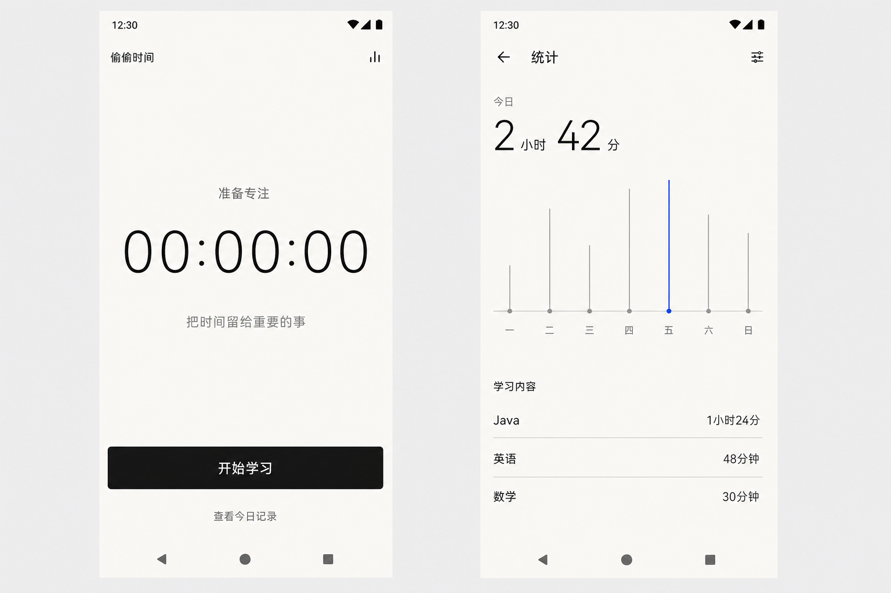

<div align="center">
  
  <h1>偷偷时间</h1>
  <p>把时间留给重要的事。</p>
  <p>一款本地优先、纸墨风格的 Android 学习计时与统计工具。</p>
</div>

## 下载体验

[直接下载偷偷时间 v0.1.0 APK](https://github.com/fplity/ToutouTime/releases/download/v0.1.0/ToutouTime-v0.1.0-debug.apk)

如果 Release 下载受到网络限制，也可以从仓库内的 [`releases/`](releases/) 目录获取同一份安装包。

当前提供的是 Debug 测试包，适合直接安装体验。最低支持 Android 8.0（API 26）。安装时如果系统提示“未知来源应用”，请只为当前文件管理器临时授权。

- 版本：`0.1.0`
- 包名：`com.example.studenttimetotalnote`
- SHA-256：`EE908EBBA01ECC5EC6F70FF09937FF78C11C2327F44F2C9EB1E3C3D19EC9D5A3`

## 界面预览

> 当前图片是已经确认并落地到应用中的界面设计预览；由于发布整理时没有可用的 ADB 设备或模拟器，因此不将其冒充为真机截图。



## 功能

- 点击“开始学习”，填写本次学习内容后立即计时。
- 计时状态会保存在本机，即使应用退到后台或重新打开也能继续恢复。
- 结束计时后自动保存本次学习记录。
- 统计页优先展示今日学习时间与本自然周趋势。
- 周、月统计收纳在右上角设置菜单中，分别展示上一完整自然周和上一完整自然月。
- 完全相同的备注会合并统计，并按累计学习时长从高到低排列。
- 点击某个备注可查看其中的每次学习记录，并可单独删除指定记录；删除后对应时间会从各周期统计中扣除。
- 没有数据时保持克制的空状态，不展示无意义的统计内容。

## 数据与隐私

偷偷时间不要求账号，也不申请联网权限。计时状态和学习记录均通过 Room 保存在设备本地。卸载应用或清除应用数据会删除这些记录；当前版本暂不提供云同步与导出功能。

## 技术栈

- Kotlin 2.1.20
- Jetpack Compose + Material 3
- Room
- ViewModel + Kotlin Coroutines
- Android Gradle Plugin 8.9.2
- Gradle 8.11.1
- JDK 17

## 本地构建

1. 使用 Android Studio 打开项目根目录。
2. 确保已安装 JDK 17 与 Android SDK 36。
3. 等待 Gradle 同步完成。
4. 在项目根目录执行：

```powershell
.\gradlew.bat :app:testDebugUnitTest :app:lintDebug :app:assembleDebug
```

生成的 APK 位于：

```text
app/build/outputs/apk/debug/app-debug.apk
```

项目的 Gradle Wrapper 默认使用腾讯镜像下载 Gradle 8.11.1，便于网络受限环境完成首次同步。

## 项目结构

```text
app/src/main/
├─ java/.../data/          # Room 数据库与本地存储
├─ java/.../domain/        # 计时、周期与聚合规则
├─ java/.../ui/home/       # 计时首页
├─ java/.../ui/statistics/ # 统计与记录管理
└─ res/                    # 图标、文字与 Android 资源
```

## 验证状态

- 12 项 JVM 单元测试通过。
- Android Lint（Debug）通过。
- Debug APK 构建通过。
- AndroidTest APK 编译通过；发布整理阶段未连接测试设备，因此本次没有执行会影响设备应用数据的仪器测试。

## 当前限制

- APK 为 Debug 测试签名，不是应用商店正式签名版本。
- 数据只保存在当前设备，暂不支持备份、导出或跨设备同步。
- 项目暂未声明开源许可证；未经许可不自动获得复制、修改或再分发授权。

