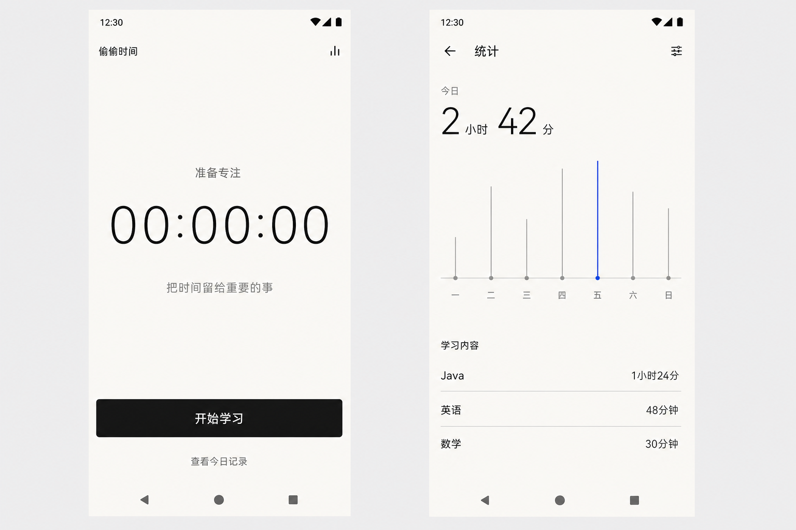

<div align="center">
  
  <h1>偷偷时间</h1>
  <p>把时间留给重要的事。</p>
  <p>一款本地优先、极简纸墨风格的 Android 学习计时与统计工具。</p>
</div>

## 项目状态

当前 Android 版本为 `0.4.0`。学习计时、记录持久化、日/周/月/年/使用以来统计、备注聚合和单条记录删除均已实现；项目源码、历史 APK、更新记录和最终交接说明已保存在本仓库。

电脑端和 Android/电脑双端同步目前只是后续目标，尚未实现。当前版本仍是单机、本地数据应用。

## 下载与安装

[直接下载偷偷时间 v0.4.0 APK](https://raw.githubusercontent.com/fplity/ToutouTime/refs/heads/main/releases/ToutouTime-v0.4.0-debug.apk)

也可以从仓库的 [`releases/`](releases/) 目录或 GitHub Releases 下载同一安装包。若聊天应用的内置浏览器阻止 APK 下载，请复制链接到手机系统浏览器打开。

- 版本：`0.4.0`（versionCode `4`）
- 包名：`com.example.studenttimetotalnote`
- 最低系统：Android 8.0（API 26）
- 文件：`releases/ToutouTime-v0.4.0-debug.apk`
- SHA-256：`84CF256A9988088270B64FBA32123AE5B0E1EBB9E0A5C4A4F6659A56684E9F07`
- 签名：Android Debug 测试签名，APK Signature Scheme v2 校验通过

> 当前 APK 用于直接安装体验，不是应用商店正式签名版本。安装时如系统提示“未知来源应用”，请仅按需为当前浏览器或文件管理器临时授权。

## 界面预览



图片是已经落地到应用中的设计预览，不冒充真机截图。应用采用暖白纸张底色、深色墨迹文字、克制的钴蓝强调色和轻量线性图形，首页将计时器作为唯一视觉焦点。

## 使用流程

1. 在首页点击“开始学习”。
2. 在弹窗中填写本次学习内容，例如 `Java`、`数学` 或 `阅读`。
3. 确认后立即开始计时；活动计时状态会保存在本机，应用退到后台或重新打开后仍可恢复。
4. 点击“结束计时”，本次记录会以开始时间、结束时间、备注和时长保存。
5. 进入统计页查看不同周期的总学习时间、趋势和备注排行。
6. 点击备注可以查看其中的每次学习记录，并可删除某一条错误记录。

## 已完成功能

### 学习计时

- 开始前填写学习备注，备注只去除首尾空格，内部文字保持原样。
- 同一时间只允许存在一个活动计时，避免重复开始覆盖正在进行的记录。
- 结束计时采用数据库事务，同时写入完成记录并清除活动状态。
- 计时状态和完成记录均由 Room 保存，不依赖应用一直停留在前台。

### 周期统计

统计全部集中在同一个页面，通过右上角菜单切换，不为不同周期增加重复页面。

| 模式 | 默认入口 | 可切换范围 | 展示规则 |
| --- | --- | --- | --- |
| 日 | 今日 | 前一天 / 后一天 | 显示具体年月日；今日实时累计 |
| 周 | 上一完整自然周 | 前一周 / 后一周 | 自然周固定为周一至周日；进入本周后实时累计 |
| 月 | 上一完整自然月 | 上个月 / 下个月 | 按自然月统计；进入本月后实时累计 |
| 年 | 今年 | 上一年 / 下一年 | 明确显示具体年份；今年实时累计并展示 12 个月趋势 |
| 使用以来 | 全部现存记录 | 不需要切换 | 汇总所有年份；不显示无意义的周期箭头和趋势图 |

- 记录跨越日、周、月或年边界时，只把与当前统计周期实际重叠的时长计入该周期。
- 没有数据的周期只保留周期选择，不展示空总览、空趋势或空排行。
- 日、周和月趋势按所选周期更新；年度趋势按 12 个月展示。

### 备注聚合与删除

- 备注按完全相同的文字归类；两条 `Java` 会合并，`Java` 与 `java` 不会合并。
- 聚合结果按累计学习时长从高到低排列；时长相同时按备注文字排序。
- 点击某个备注可查看其中的独立学习记录及各自在当前周期内贡献的时长。
- 删除操作只删除所选记录；删除后该记录不再计入日、周、月、年和“使用以来”总学习时间。
- 删除不可撤销，界面会在确认前明确提示影响。

## 数据与隐私

- 应用不要求注册账号，也没有声明联网权限。
- 活动计时和学习记录保存在应用自己的 Room 数据库中。
- 项目本身不提供云同步、数据导出或跨设备迁移。
- 清除应用数据会删除记录；卸载后的恢复行为还可能受设备系统备份设置影响。
- 数据库文件、签名密钥和本机 SDK 配置均不会提交到 Git 仓库。

## 技术实现

- Kotlin `2.1.20`
- Jetpack Compose + Material 3
- Room `2.7.0`
- ViewModel + Kotlin Coroutines
- Android Gradle Plugin `8.9.2`
- Gradle `8.11.1`
- JDK 17 / Android SDK 36

代码按数据、领域和界面职责拆分：

```text
app/src/main/
├─ java/.../data/          # Room 实体、DAO、数据库和存储边界
├─ java/.../domain/        # 计时仓库、周期解析、时间重叠与备注聚合
├─ java/.../ui/home/       # 首页计时状态与交互
├─ java/.../ui/statistics/ # 周期选择、趋势、记录详情与删除
├─ java/.../navigation/    # 首页和统计页导航
└─ res/                    # 应用名称、图标和 Android 资源
```

更完整的维护与恢复信息见 [`docs/PROJECT_HANDOFF.md`](docs/PROJECT_HANDOFF.md)。版本变化见 [`CHANGELOG.md`](CHANGELOG.md)。

## 本地构建

1. 使用 Android Studio 打开仓库根目录。
2. 确保已安装 JDK 17 与 Android SDK 36。
3. 等待 Gradle 同步完成。
4. 在仓库根目录执行：

```powershell
.\gradlew.bat :app:testDebugUnitTest :app:lintDebug :app:assembleDebug :app:assembleDebugAndroidTest
```

主要输出：

```text
app/build/outputs/apk/debug/app-debug.apk
app/build/outputs/apk/androidTest/debug/app-debug-androidTest.apk
app/build/reports/lint-results-debug.html
app/build/reports/tests/testDebugUnitTest/index.html
```

Gradle Wrapper 已改用腾讯镜像下载 Gradle 8.11.1，方便网络受限环境首次同步。若 Windows 用户目录包含非 ASCII 字符并出现缓存问题，可以把 `GRADLE_USER_HOME` 临时设置到项目内的 ASCII 路径，例如 `.tmp-build/gradle-real`。

## 验证状态

2026-10-06 最后一次完整本地验证包含：

- 21 项 JVM 单元测试通过，0 失败。
- Android Lint（Debug）通过，0 Fatal、0 Error；保留 46 条非阻塞 Warning。
- Debug APK 构建通过。
- AndroidTest APK 构建通过。
- v0.4.0 APK 包名、版本号、SHA-256 和 v2 签名已核对。

AndroidTest 目前只完成编译，尚未在连接设备上执行；设计预览也不是当前版本的真机验收截图。因此，本仓库准确描述为“功能与构建已验证的 Debug 版本”，不是已完成商店发布验收的正式版本。

## 版本整合

| 版本 | 主要变化 |
| --- | --- |
| 0.1.0 | 完成计时首页、今日/周/月统计、备注聚合、单条记录删除和应用图标 |
| 0.2.0 | 在原统计页加入具体年份与年度统计、年度切换和 12 个月趋势 |
| 0.3.0 | 日、周、月、年统一支持前后周期浏览，并明确显示具体日期范围 |
| 0.4.0 | 加入“使用以来”总学习时间，删除记录同步影响所有周期与总计 |

仓库保留各阶段 APK，便于回溯；推荐使用最新的 v0.4.0。

## 当前限制与后续方向

- 当前 APK 使用 Debug 测试签名，正式发布需要独立 release 密钥和发布材料。
- 统计数据只存在当前设备，没有备份、导出、账号或云同步界面。
- 电脑端、同步服务、稳定跨设备 UUID、离线重试、删除同步和冲突处理都尚未实现。
- 若继续开发双端同步，建议保留离线优先思路，只同步已结束记录，并通过服务端增量同步；不要直接复制 Room/SQLite 数据库文件。
- 项目目前没有声明开源许可证；公开可见不等于自动授权复制、修改或再分发。
